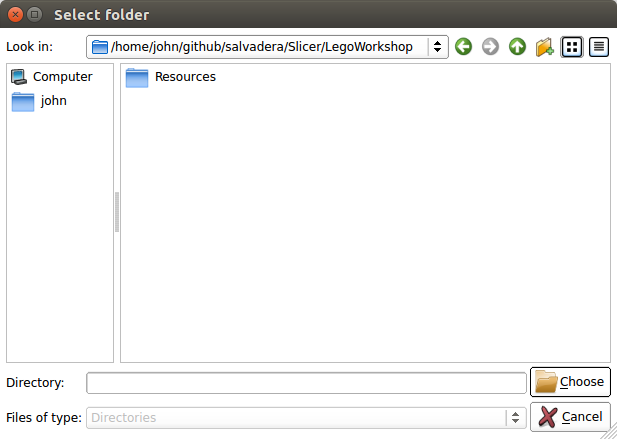
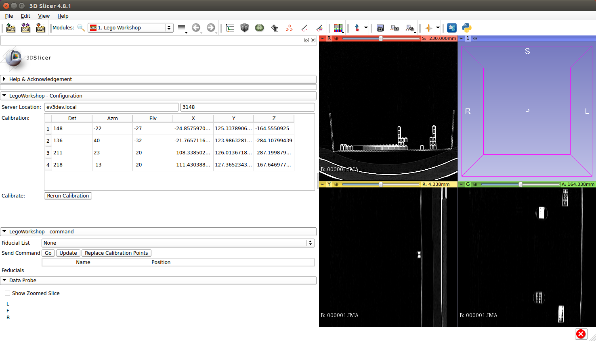
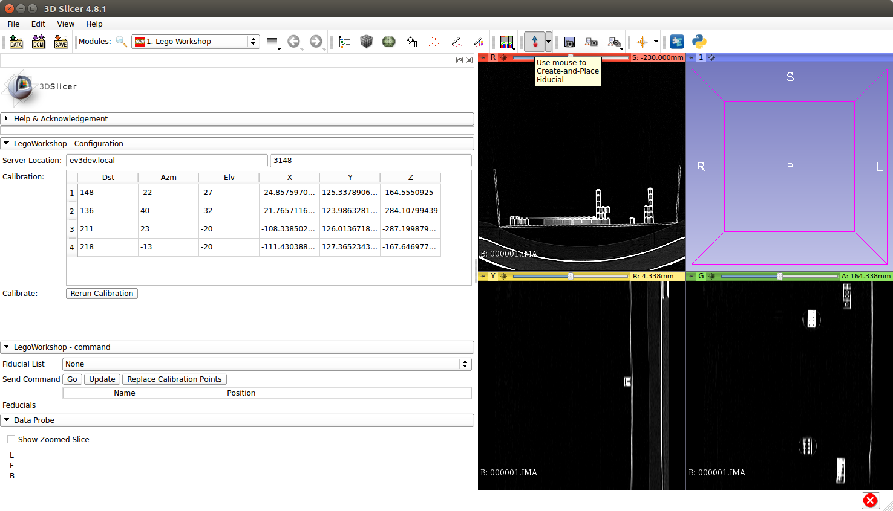

LEGO Mindstorms IGT Workshop
============================

This workshop is designed to work with the  
[LEGO Mindstorms EV3 kit](https://shop.lego.com/en-GB/LEGO-MINDSTORMS-EV3-31313)
and a standard 
[box of lego bricks](https://shop.lego.com/en-GB/LEGO-Large-Creative-Brick-Box-10698). 

This is an updated version of the 
[workshop](https://na-mic.org/wiki/LEGO_IGT_and_Medical_Robotics_Tutorial)
originally developed by the National Alliance for Medical Imaging Computing
which used the previous generation LEGO Mindstorms.

The phantom hasn't changed from the previous workshop, so you can use the same 
[inststructions](https://na-mic.org/w/images/0/0d/LEGOIGTAndMedicalRoboticsTutorial_PhantomAssemblyInstructions.pdf)
to construct it. Note that the newer 
[box of lego bricks](https://shop.lego.com/en-GB/LEGO-Large-Creative-Brick-Box-10698)
does not have the same bricks as the old one, so substitutions have to be made.

We are using the 3rd party [ev3dev](http://www.ev3dev.org/) operating system 
to program the EV3 brick. If you are using a kit that has already been used for 
this workshop it most likely already has that OS installed. However, if not 
follow the instructions [here](http://www.ev3dev.org/docs/getting-started/).

The brick must be connected to the internet somehow, both to download the script
and to communicate with the PC. Since we don't need mobility, there is no reason
to set up a wireless connection, and the 
[USB connection](http://www.ev3dev.org/docs/tutorials/connecting-to-the-internet-via-usb/)
should be fine.

To get the script on the EV3 brick you can either clone this repository, or just
copy and paste the contents of the `lego-workshop.py` file into a new file on 
the EV3. If you do, make sure to mark the new file as executable.

For the PC, download [Slicer](https://www.slicer.org/). This workshop has been 
tested with [version 4.8.1](http://slicer.kitware.com/midas3/folder/4989)
but it should work with similar versions. 

Open the Application Settings by clicking `Edit->Application Settings`:

Go to the `Modules` tab:

Add a path under `Additional Module Paths` which points to the folder named 
LegoWorkshop in this repository:

Now that directory will be in the list:

This will require a reboot of the program to take effect:

To use the module, load it from the Modules menu:

Make sure that under `LegoWorkshop - Configuration` 
the server address matches the address of your brick, (probably `ev3dev.local`).
If `ev3dev.local` doesn't work, get the IP of the EV3 from the menu 
`WirelessAndNetowrks->AllNetowrkConnections->[Wired or other]->IPv4`.
If the module loaded correctly it should look something like the following:

Download the 
[CT volume of the LEGO phantom](http://wiki.na-mic.org/Wiki/images/6/69/000003.SER.zip)
and extract it somewhere. Now open that data with `File->Add Data` and point to 
the first file in the series:

Show additional options:

Uncheck the `Single File` box:

Click OK. Now you should see the CT scan of a LEGO phantom:

Then add a Fiducial to the point you want to target by clicking on the icon with
the red dot and blue arrow:

Then click somewhere you want the robot to probe, and then choose the feducial 
namespace (`F`) and that position will be sent to the robot:

